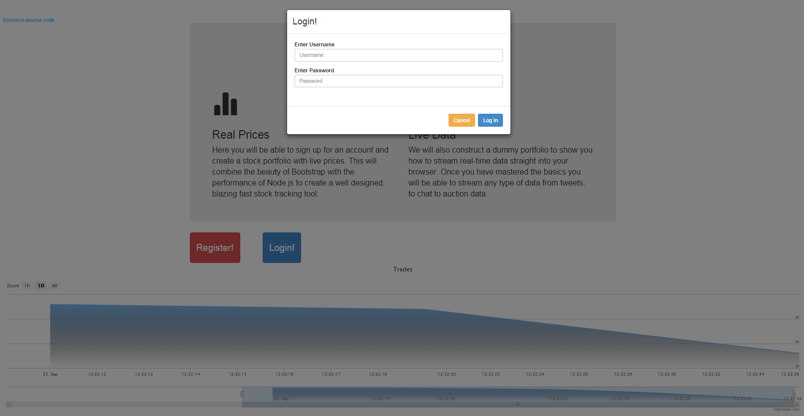
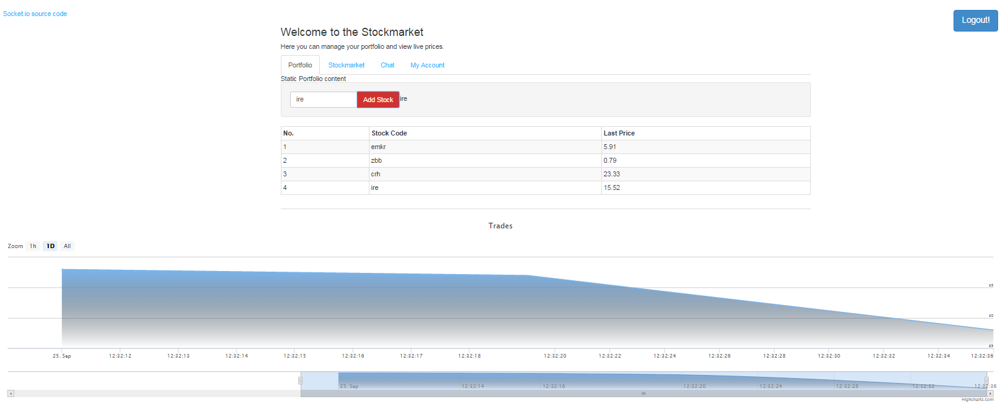
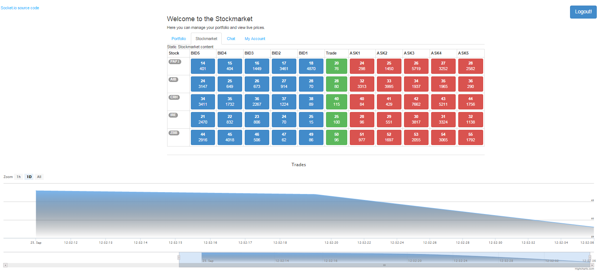
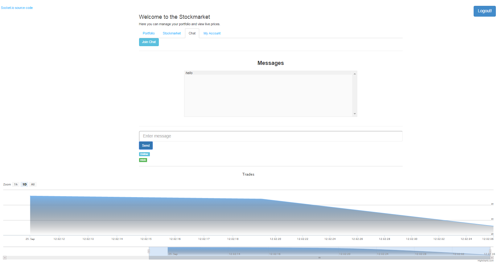
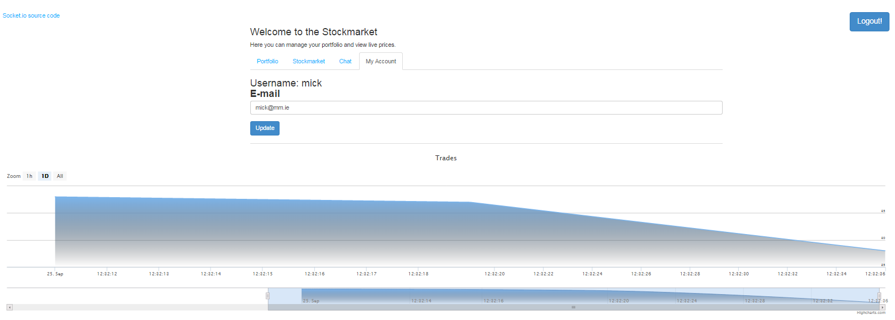

## A simulated stock exchange streaming real-time data to Angular client using socket.io

Real-Time Data streaming from Node server to Angular View over socket.io.
 
Retrieve Stock Prices from Yahoo Finance via the Yahoo API.

++++++++++++++++++++++++++++++++++++++++++++++++++++++++++++++++++++++++++

NOTE - This App is NOT COMPLETED - HOWEVER IT IS WORKING WITH NO ERRORS

There are still a few issues to iron out:
- Clicking the Logout button does not end socket.io
- a few other minor issues

++++++++++++++++++++++++++++++++++++++++++++++++++++++++++++++++++++++++++

Based on the Book ["Jump Start NodeJS"](http://www.sitepoint.com/store/jump-start-node-js/) by Don Nguyen.
However I implemented this App using an Angular client. 

This App demonstrates the following:

- Angular authentication to a Node server
- Connecting to MongoDB
- Interacting with MongoDB using Native driver instead of Mongoose
- Wire up Authentication system to work with Socket.io 1.1
- Using Redis Key-value store to hold session variables 
- Using Angular UI-Bootstrap Modal and Tab elements
- get AngularJS working with SocketIO 
- access session information within Socket.io code (where there is no access via req object)
- Retrieve stock prices from Yahoo Finance using API (it's the only free data) 
- Create a simulated stock exchange on the Node server (i.e. create data that includes made up traded volumes as well as prices)
- Stream stock Exchange data from Node to client via socket.io
- Update a table on the Angular View with the updated stock exchange data in real time
- [HighCharts](http://www.highcharts.com/) as a data visualisation tool

This App builds on the following repositories:
* sio-ng-sessions-redis
* ng-socket-io-IM-chat
* ng-socket-io-seed (I used BT Fords angular-socket-io Module)

## App Specifics

What is the optimum method of rendering data in an Angular view?
I converted the streamed data on the client to an array of JS objects.

In the view I have used a standard HTML table along with the ng-repeat directive to populate the table body:

<pre>
&lt;tr ng-repeat="item in dataArr track by item.st" &gt;
...
&lt;/tr&gt;
</pre>

I became aware today, for the first time [the importance of the ng-repeat 'track by'](http://www.codelord.net/2014/04/15/improving-ng-repeat-performance-with-track-by/) in speeding up ng-repeat by reducing DOM operations. ngRepeat adds a $$hashKey property to each item to keep track of them. Using 'track by' index you can assign an index for the DOM to use that matches your data array index. ng-repeat can then tell when a new array item matches an existing item because the index is the same. It now does not need to destroy and recreate items with identical indexes on each refresh.

Basically without setting a proper 'track by' index. No new data will have the $$hashKey property and so ngRepeat will not know that they represent existing elements and will remove and recreate the items on each refresh. 

I have selected to 'track by item.st' - item.st is the name of the stock. It is unique to each stock. 

Other alternatives to standard html5 tables are:
- ngTable
- trNgGrid
- Smart Table
- ngGrid

## Main Technologies Used:

* AngularJS 
* NodeJS
* MongoDB
* Express 4.7 
* Express Sessions 
* Redis (key-value store) 
* Socket.IO 1.1 
* Angular UI-Bootstrap
* JQuery

## Running the App

- run MongoDB
- run Redis
- clone the repository
- npm install
- bower install
- node server.js
- browse to 'http://localhost:3000'

## Screen Shots

		
		
		

		
		
		

		

Michael Cullen 2014

